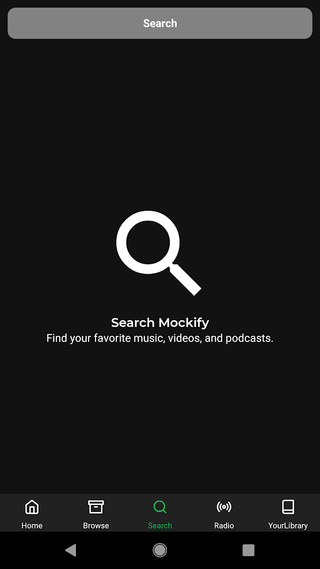

# Mockify
A clone of Spotify using React Native

### Current Progress / Demo

### Major dependencies/features

* State Management - [Redux](https://redux.js.org/)
* Routing/Navigation - [React Navigation](https://reactnavigation.org/)
* Icon Pack- [React Native Vector Icons](https://github.com/oblador/react-native-vector-icons). Specifically used [Feather Icons](https://feathericons.com/) and [Material Design Icons](https://material.io/tools/icons/)